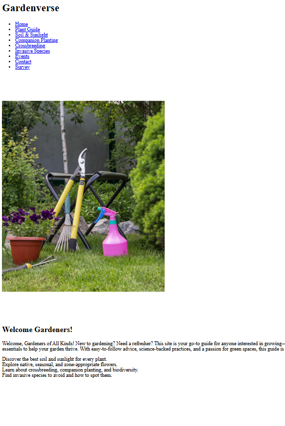

<h1>Gardenverse Website</h1>

Gardenverse is a fully mobile-friendly website that brings together all the HTML skills I've learned so far—tables, forms, semantic layout, navigation menus, and both ordered and unordered lists. Designed as an all-in-one gardening guide, it offers helpful info for everyone from first-time planters to seasoned growers. Every page is built to meet modern web standards for accessibility, structure, and usability.

  
  
This is the foundational HTML layout structure for my gardening page, created prior to applying my css styling.

  
    
